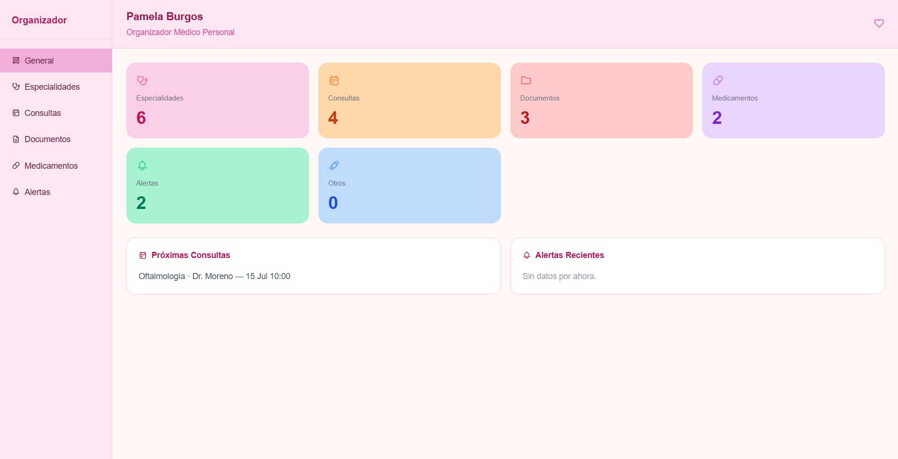
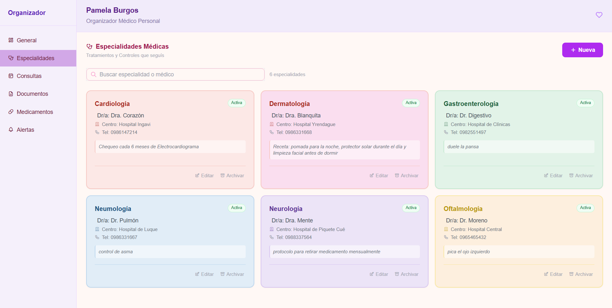
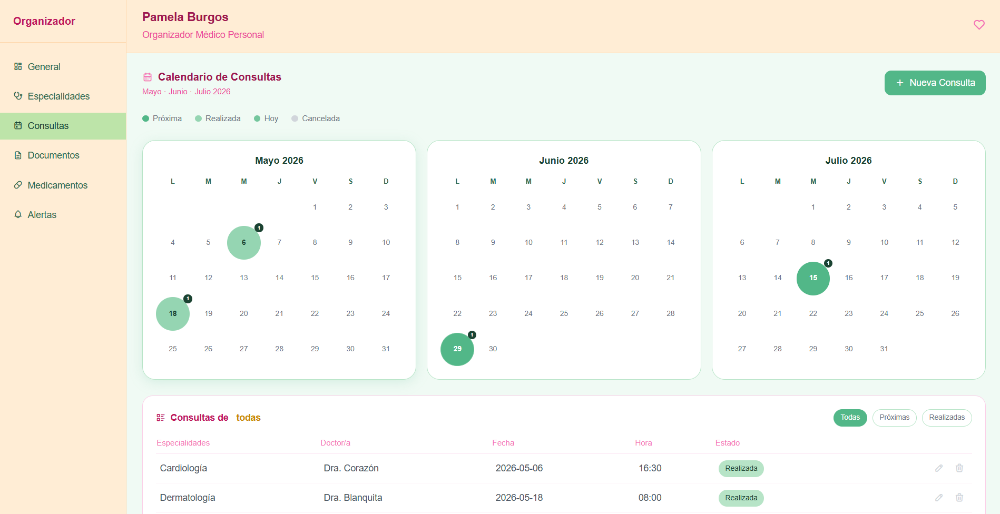
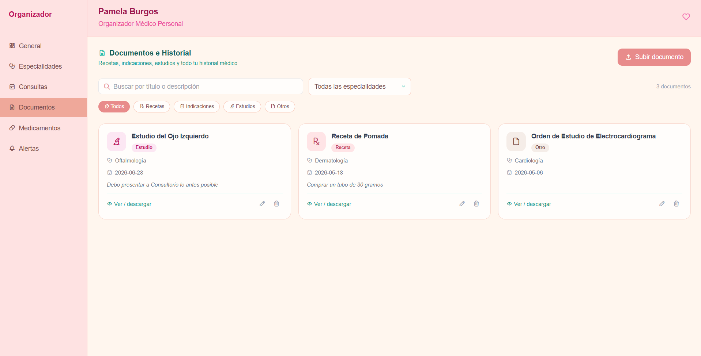
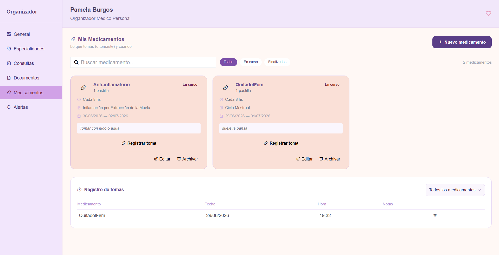
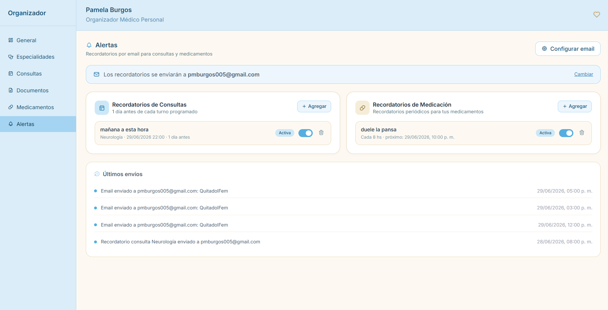
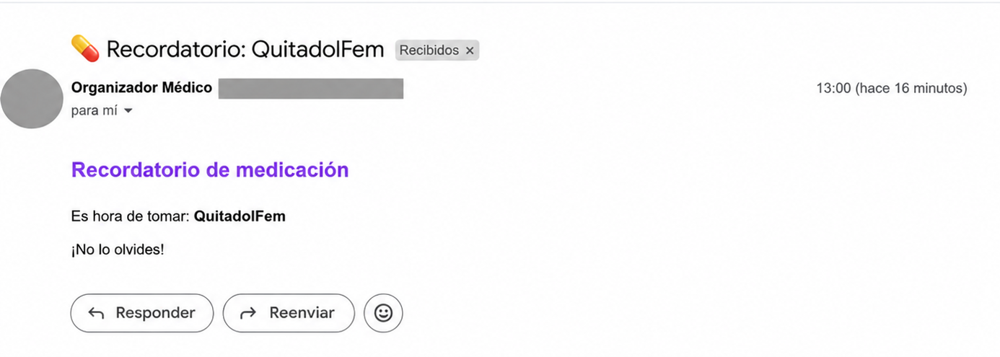
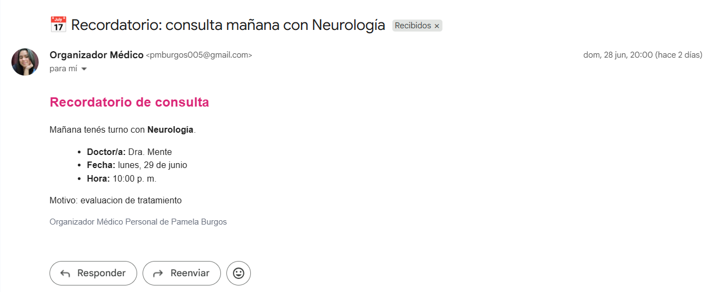

# Organizador Médico Personal
Sistema desarrollado para centralizar y organizar toda la información médica personal de una persona: especialidades, consultas, medicamentos, documentos, e historial, con recordatorio automático por email.

## Descripción del Proyecto
Este proyecto nació de una necesidad real: tener todo en un solo lugar, ordenado, accesible y con recordatorios que funcionan solos, también sirve de backup de documentos físicos. Además maneja múltiples tratamientos médicos con distintos especialistas, horarios, recetas e indicaciones que sin un sistema de ordenamiento podría ser caótico.

El sistema está pensado para administrar la información médica de un único paciente.

## Características
- Gestión de Especialidades Médicas.
- Agenda de Consultas con Calendario.
- Historial de Documentos Médicos.
- Control de Medicamentos y registro de Tomas.
- Recordatorios Automaticos por email.
- Historial de Alertas Enviadas.
- Organización centralizada de la Información Médica.

## Funcionalidades
### Dashboard general
Vista rápida con contadores de especialidad, consultas, documentos y medicamentos activos. Muestra las próximas consultas programadas y las alertas más recientes de un vistazo.


### Especialidades médicas
Registro de cada especialidad médica que la persona tiene: nombre del doctor, centro médico, teléfono, notas del tratamiento. Incluye baja lógica (archivar una especialidad) que el usuario ya no quiere ver en la página cuando completa un tratamiento, pero queda en el historial.


### Consultas
Calendario visual de turnos con vista de 3 meses. Cada consulta se asocia a una especialidad, con fecha, hora, motivo y notas post-consulta. Permite filtrar por próxima o realizada.


### Documentos e historial
Carga de archivos médicos (recetas, estudios, indicaciones). Soporta PDF, JPG y WEBP hasta 15 MB. Los documentos se pueden filtrar por tipo y especialidad, también descargar directamente.


### Medicamentos
Catálogo de medicamentos activos y finalizados con dosis, frecuencia, vía de administración e indicación. Incluye un registro de tomas para llevar control de cuándo se tomó cada medicamento.


### Alerta automática por email
Sistema de recordatorio con dos tipos:
- Recordatorio de consultas: se envía automáticamente el día anterior de cada turno programado.
- Recordatorio de medicación: se envía periódicamente según la frecuencia configurada (cada x horas).

El sistema utiliza un cron job que revisa y envía alertas cada hora, y guarda un historial de todos los envíos realizados.


### Alerta recibida de Medicamento

### Alerta recibida de Consulta


## Tecnologías utilizadas
Backend:                Node.js + Express 5 
Base de datos:          Oracle Database XE (`oracledb`) 
Emails:                 Nodemailer + Gmail 
Tareas programadas:     node-cron 
Carga de archivos:      Multer 
Variables de entorno:   dotenv 
Frontend:               HTML + CSS + JavaScript vanilla

## Esquema de la base de datos
El sistema gira en torno a 7 tablas relacionadas en Oracle: una especialidad puede tener varias consultas, documentos y alertas asociadas, y los medicamentos llevan su propio registro de tomas.

Se eligió Oracle como ejercicio de practica con base de datos de nivel empresarial.
```
especialidades ──┬──> consultas ──> documentos
                  └──> alertas

medicamentos ──> tomas_medicamentos
```
## Estructura del proyecto
```
organizador-medico/
├── server.js               # Configuración de Express
├── db.js                   # Conexión a Oracle Database
├── alerta.env              # Variables de entorno (no se sube a Git)
├── routes/
│   ├── dashboard.js        # Resumen general
│   ├── especialidades.js   # CRUD de especialidades
│   ├── consultas.js        # CRUD de consultas + filtros por mes
│   ├── documentos.js       # Carga y gestión de archivos
│   ├── medicamentos.js     # CRUD de medicamentos + registro de tomas
│   └── alertas.js          # Alertas + cron job + historial de envíos
├── public/
│   ├── *.html              # Páginas del frontend (todas las páginas)
│   ├── css/                # Estilos por módulo (todas las páginas)
│   └── js/                 # Lógica del frontend por módulo (todas las páginas)
└── uploads/                # Archivos subidos (no se sube a Git)
```
## Arquitectura de Funcionalidad
Frontend (HTML/CSS/JS)
        │
Node.js + Express
        │
Oracle Database XE
        │
node-cron + Nodemailer

## Instalación y uso
### Requisitos previos
- Node.js v18 o superior
- Oracle Database XE instalado y corriendo
- Cuenta de Gmail con contraseña de aplicación habilitada

### 1. Clonar el repositorio
```bash
git clone https://github.com/pameburgos/organizador-medico-personal.git
cd organizador-medico
```

### 2. Instalar dependencias
```bash
npm install
```

### 3. Configurar variables de entorno
Crear un archivo `alerta.env` en la raíz del proyecto con el siguiente contenido:
```
EMAIL_USER=tu-email@gmail.com
EMAIL_PASS=tu-contraseña-de-aplicacion
DB_USER=tu-usuario-oracle
DB_PASS=tu-contraseña-oracle
DB_STRING=localhost/XEPDB1
```
Para obtener la contraseña de aplicación de Gmail: Cuenta de Google → Seguridad → Verificación en dos pasos → Contraseñas de aplicación.

### 4. Crear las tablas en Oracle
Ejecutar en Oracle SQL Developer o SQL*Plus los siguientes CREATE TABLE:
```sql
CREATE TABLE especialidades (
    id_especialidad  NUMBER GENERATED BY DEFAULT AS IDENTITY PRIMARY KEY,
    nombre           VARCHAR2(100) NOT NULL,
    nombre_doctor    VARCHAR2(100),
    telefono_doctor  VARCHAR2(20),
    centro_medico    VARCHAR2(150),
    estado           VARCHAR2(50),
    notas            VARCHAR2(500),
    activa           NUMBER(1,0) DEFAULT 1,
    fecha_creacion   DATE DEFAULT SYSDATE
);
CREATE TABLE consultas (
    id_consulta      NUMBER GENERATED BY DEFAULT AS IDENTITY PRIMARY KEY,
    id_especialidad  NUMBER REFERENCES especialidades(id_especialidad),
    fecha_hora       TIMESTAMP NOT NULL,
    motivo           VARCHAR2(300),
    notas_post       VARCHAR2(500),
    estado           VARCHAR2(20) DEFAULT 'Programada',
    fecha_creacion   DATE DEFAULT SYSDATE
);
CREATE TABLE documentos (
    id_documento     NUMBER GENERATED BY DEFAULT AS IDENTITY PRIMARY KEY,
    id_especialidad  NUMBER REFERENCES especialidades(id_especialidad),
    id_consulta      NUMBER REFERENCES consultas(id_consulta),
    tipo             VARCHAR2(15) NOT NULL,
    titulo           VARCHAR2(60) NOT NULL,
    descripcion      VARCHAR2(500),
    nombre_archivo   VARCHAR2(60),
    ruta_archivo     VARCHAR2(500),
    fecha_documento  DATE,
    fecha_carga      DATE DEFAULT SYSDATE
);
CREATE TABLE medicamentos (
    id_medicamento   NUMBER GENERATED BY DEFAULT AS IDENTITY PRIMARY KEY,
    nombre           VARCHAR2(200) NOT NULL,
    dosis            VARCHAR2(100),
    frecuencia       VARCHAR2(100),
    via              VARCHAR2(50) DEFAULT 'Oral',
    indicacion       VARCHAR2(300),
    fecha_inicio     DATE,
    fecha_fin        DATE,
    notas            VARCHAR2(500),
    activo           NUMBER(1,0) DEFAULT 1
);
CREATE TABLE tomas_medicamentos (
    id_toma          NUMBER GENERATED BY DEFAULT AS IDENTITY PRIMARY KEY,
    id_medicamento   NUMBER REFERENCES medicamentos(id_medicamento),
    fecha_hora_toma  DATE NOT NULL,
    notas            VARCHAR2(300)
);
CREATE TABLE alertas (
    id_alerta        NUMBER GENERATED BY DEFAULT AS IDENTITY PRIMARY KEY,
    tipo             VARCHAR2(20) NOT NULL,
    id_referencia    NUMBER,
    nombre_med       VARCHAR2(200),
    descripcion      VARCHAR2(300),
    canal            VARCHAR2(10) DEFAULT 'email',
    destinatario     VARCHAR2(200) NOT NULL,
    frecuencia_hs    NUMBER DEFAULT 24,
    proximo_envio    TIMESTAMP,
    activa           NUMBER(1,0) DEFAULT 1,
    fecha_creacion   DATE DEFAULT SYSDATE,
    fecha_fin        TIMESTAMP,
    total_envios     NUMBER DEFAULT 0,
    envios_realizados NUMBER DEFAULT 0
);
CREATE TABLE historial_alertas (
    id_historial     NUMBER GENERATED BY DEFAULT AS IDENTITY PRIMARY KEY,
    id_alerta        NUMBER REFERENCES alertas(id_alerta),
    descripcion      VARCHAR2(500),
    exitoso          NUMBER(1,0),
    fecha_envio      TIMESTAMP DEFAULT SYSTIMESTAMP
);
```

### 5. Iniciar el servidor
```bash
node server.js
```
Abrir en el navegador: http://localhost:3000

## Seguridad
- Las credenciales de base de datos y email se manejan exclusivamente mediante variables de entorno.
- El archivo de entorno está excluido del repositorio con .gitignore.
- Los archivos subidos por el usuario no se publican en Git.
- Las queries SQL utilizan parámetros enlazados en todos los casos para prevenir SQL injection.

## Para colaboradores
Este proyecto fue desarrollado como ejercicio personal de portafolio, pero está abierto a sugerencias y mejoras.

Si querés colaborar:
1. Hacé un fork del repositorio.
2. Creá una rama para tu cambio (`git checkout -b mejora-nombre`).
3. Hacé commits claros explicando qué cambiaste y por qué.
4. Abrí un pull request describiendo el cambio propuesto.

Para reportar un error o sugerir una mejora sin escribir código, podés abrir un issue describiendo el problema o la idea, con pasos para reproducirlo si aplica.

## Desarrollado por
Pamela Burgos - Proyecto de Organizador Médico Personal — 2026